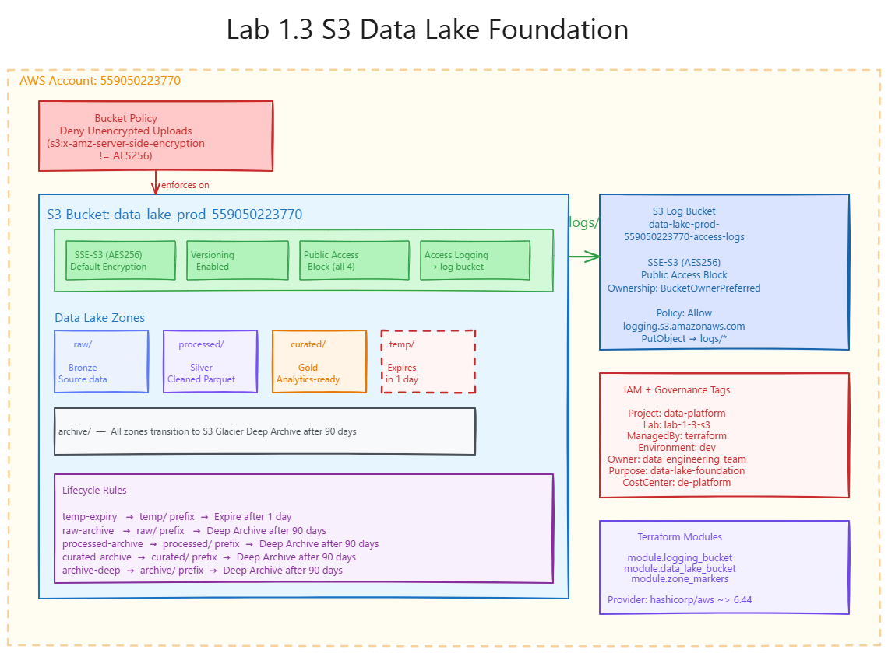

# Lab 1.3 - S3 Data Lake Foundation

Terraform implementation of the production S3 data lake defined in `Lab_1_3.md`.

---

## Architecture



Excalidraw sources are not tracked on GitHub (see `.gitignore` for `*.excalidraw`). Export a PNG named `setup-architecture.png` in this folder if you want the diagram above to render on GitHub, like Labs 1.1 and 1.2.

---

## Prerequisites

- Terraform >= 1.5.0
- AWS CLI configured with the `default` profile pointing to account `559050223770`
- The `default` profile must have S3 write permissions (PowerUser or Admin)

Verify your identity before running:

```bash
aws sts get-caller-identity
```

Expected output:

```json
{
  "UserId": "AIDAYEKP5OCNK52FU2LJV",
  "Account": "559050223770",
  "Arn": "arn:aws:iam::559050223770:user/windows_cli"
}
```

---

## Structure

```
lab-1-3-s3/
├── README.md          <- you are here
├── user-guide.md      <- plain-English walkthrough
└── terraform/
    ├── main.tf                          # root: provider + module wiring
    ├── variables.tf
    ├── outputs.tf
    ├── terraform.tfvars.example
    └── modules/
        ├── logging_bucket/              # access-log destination bucket
        │   ├── main.tf
        │   ├── variables.tf
        │   └── outputs.tf
        ├── data_lake_bucket/            # main data lake bucket + all config
        │   ├── main.tf
        │   ├── variables.tf
        │   └── outputs.tf
        └── zone_markers/               # zero-byte prefix objects (raw, processed, curated, temp, archive)
            ├── main.tf
            ├── variables.tf
            └── outputs.tf
```

---

## Module Dependency

```
main.tf
  └── module.logging_bucket     -> creates log destination bucket
        ↓ logging_bucket_id
  └── module.data_lake_bucket   -> creates main bucket wired to log bucket
        ↓ data_lake_bucket_id
  └── module.zone_markers       -> creates prefix markers inside the main bucket
```

---

## Variables

| Name           | Description                              | Default                    |
|----------------|------------------------------------------|----------------------------|
| `aws_region`   | Region to deploy into                    | `us-east-1`                |
| `project`      | Project tag applied to all resources     | `data-platform`            |
| `lab`          | Lab tag applied to all resources         | `lab-1-3-s3`               |
| `environment`  | Environment tag (governance)             | `dev`                      |
| `owner`        | Owner tag (governance)                   | `data-engineering-team`    |
| `purpose`      | Purpose tag (governance)                 | `data-lake-foundation`     |
| `cost_center`  | CostCenter tag (governance)              | `de-platform`              |

---

## Outputs

| Output                          | Description                                      |
|---------------------------------|--------------------------------------------------|
| `account_id`                    | AWS account resources were deployed into         |
| `data_lake_bucket_id`           | Name of the main data lake bucket                |
| `data_lake_bucket_arn`          | ARN of the main data lake bucket                 |
| `logging_bucket_id`             | Name of the access-log destination bucket        |
| `logging_bucket_arn`            | ARN of the access-log destination bucket         |
| `data_lake_bucket_domain_name`  | Regional domain name for the data lake bucket    |

---

## Usage

```bash
cd terraform/

# 1. Copy example vars (no edits needed for a standard lab run)
cp terraform.tfvars.example terraform.tfvars

# 2. Initialise
terraform init

# 3. Check for syntax errors
terraform validate

# 4. Preview what will be created
terraform plan

# 5. Provision
terraform apply

# 6. When done - full teardown
terraform destroy
```

---

## What Gets Created

### Buckets

| Bucket | Purpose |
|--------|---------|
| `data-lake-prod-<account_id>` | Main data lake - encrypted, versioned, private, lifecycle-managed |
| `data-lake-prod-<account_id>-access-logs` | Receives S3 server access logs from the main bucket |

### Security Configuration

| Setting | Value |
|---------|-------|
| Public access | Blocked on all four controls |
| Server-side encryption | SSE-S3 (AES256), enforced via bucket policy |
| Unencrypted uploads | Denied by explicit bucket policy condition |

### Data Lake Zones (prefix markers)

| Prefix | Zone | Retention |
|--------|------|-----------|
| `raw/` | Bronze - immutable source data | Indefinite |
| `processed/` | Silver - cleaned Parquet data | 2-7 years |
| `curated/` | Gold - business-ready analytics data | Indefinite |
| `temp/` | Work - temporary job outputs | **Deleted after 1 day** |
| `archive/` | Compliance - long-term storage | Transitioned to Deep Archive after 90 days |

### Lifecycle Rules

| Rule | Target | Action |
|------|--------|--------|
| `temp-expiry` | `temp/` prefix | Expire objects after 1 day |
| `archive-transition` | All non-temp prefixes (applied per zone) | Transition to `DEEP_ARCHIVE` after 90 days |

---

## Tags Applied to All Resources

```
Project     = data-platform
Lab         = lab-1-3-s3
ManagedBy   = terraform
Environment = dev
Owner       = data-engineering-team
Purpose     = data-lake-foundation
CostCenter  = de-platform
```
